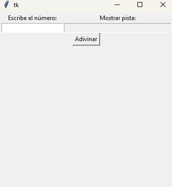

# Adivina el Número

Este es un juego simple en el que el usuario debe adivinar un número aleatorio entre 1 y 100. El programa proporciona pistas sobre si el número ingresado es mayor o menor que el número correcto, y cuenta la cantidad de intentos que lleva el jugador. El juego está desarrollado en Python utilizando **Tkinter** para la interfaz gráfica.

<p align="center">
  
</p>


## Características

- Juego de adivinanza de un número aleatorio entre 1 y 100.
- Interfaz gráfica sencilla creada con **Tkinter**.
- El programa muestra pistas sobre si el número ingresado es mayor o menor que el número correcto.
- Cuenta la cantidad de intentos realizados para adivinar el número.

## Requisitos

- Python 3.x
- Tkinter (generalmente viene preinstalado con Python)

## Instrucciones de Uso

1. **Instalación**: Asegúrate de tener **Python 3.x** instalado en tu sistema. Si no tienes Tkinter, instálalo utilizando el siguiente comando (en caso de que no esté preinstalado):

   ```bash
   pip install tk
